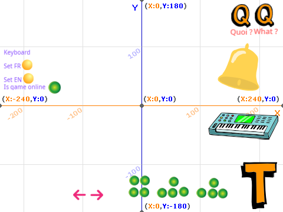
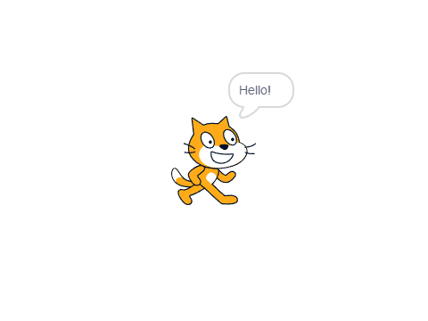
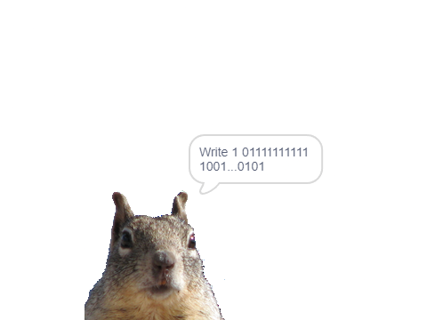

# Scratch project automatic portfolio  
  
> Find here all the projects I have been working on until now.  
## 979384709: Example: Lock position of object  
  
  
  
https://scratch.mit.edu/projects/979384709  
## 975682430: Quick test Scrapping 199999999  
  
  
  
https://scratch.mit.edu/projects/975682430  
## 973755515: Test  
  
  
  
https://scratch.mit.edu/projects/973755515  
## 972007352: Force Following Line  
  
  
  
https://scratch.mit.edu/projects/972007352  
## 971971914: Unity example voiture couleur  
  
  
  
https://scratch.mit.edu/projects/971971914  
## 971574782: Unit 2 Scratch: Bonjour (Il y a une voiture dans mon écran)  
  
  
  
https://scratch.mit.edu/projects/971574782  
## 967799973: TDD: Random Cloud VAR   
  
  
  
https://scratch.mit.edu/projects/967799973  
## 967408633: Page: Build 1 0000 9999 1 Cloud Var Input  
  
Game : Hello Car RC (HeRC) https://github.com/EloiStree/HelloRC
  
  
https://scratch.mit.edu/projects/967408633  
## 966915770: Scratch as All basic in one   
  
  
  
https://scratch.mit.edu/projects/966915770  
## 966336670: Page: Var Cloud Sound Detector Online (2024_02_15_ScratchSoundVideoDetector))  
  
Exercice for learning code by Scratch in a Unity3D MMO project: https://github.com/EloiStree/HelloRC
Page: https://github.com/EloiStree/HelloRC/issues/9  
  
https://scratch.mit.edu/projects/966336670  
## 966307753: Page: Multiplayer Var Cloud "Catch it first" (2024_02_15_BatCatchItFirst)  
  
  
  
https://scratch.mit.edu/projects/966307753  
## 966123505: Page: Drone In Scratch  
  
Exercice for learning code by Scratch in a Unity3D MMO project: https://github.com/EloiStree/HelloRC
Page: https://github.com/EloiStree/HelloRC/issues/5

  
  
https://scratch.mit.edu/projects/966123505  
## 965772307: Check limit of a cloud and if text is usable  
  
  
  
https://scratch.mit.edu/projects/965772307  
## 965687852: Example: Use of Blocks of music remix  
  
  
  
https://scratch.mit.edu/projects/965687852  
## 965616480: Example: Draw Point and Line :)  
  
  
  
https://scratch.mit.edu/projects/965616480  
## 965584985: Page: Tank Car RC as crab    
  
Exercice for learning code by Scratch in a Unity3D MMO project: https://github.com/EloiStree/HelloRC
Page: https://github.com/EloiStree/HelloRC/issues/6
  
  
https://scratch.mit.edu/projects/965584985  
## 965553511: Example: Import Export Text  
  
  
  
https://scratch.mit.edu/projects/965553511  
## 962222913: Test Panda  
  
  
  
https://scratch.mit.edu/projects/962222913  
## 961186904: Hello Car RC (Scratch Client)  
  
  
  
https://scratch.mit.edu/projects/961186904  
## 960534356: Page: My first Cloud Var application  
  
https://github.com/EloiStree
Like this project?
Make a donation to Scratch:
https://www.scratchfoundation.org/donate
The cloud var and web api are host by them.
  
  
https://scratch.mit.edu/projects/960534356  
## 979427907: Example: Action when changed  
  
  
  
https://scratch.mit.edu/projects/979427907  
## 968115797: Scratch 2 Unity: As C#  
  
  
  
https://scratch.mit.edu/projects/968115797  
## 968113085: Scratch 2 Unity: As MonoBehavior  
  
  
  
https://scratch.mit.edu/projects/968113085  
## 968104571: Unity 2 Scratch: Play Midi from Cloud VAR  
  
  
  
https://scratch.mit.edu/projects/968104571  
## 968103105: Scratch 2 Unity: Drawing  
  
  
  
https://scratch.mit.edu/projects/968103105  
## 968102729: Scratch 2 Unity: MIDI  
  
  
  
https://scratch.mit.edu/projects/968102729  
## 968102239: Scratch 2 Unity: Fetch var and engine var  
  
  
  
https://scratch.mit.edu/projects/968102239  
## 968101481: Scratch 2 Unity: Blocks  
  
  
  
https://scratch.mit.edu/projects/968101481  
## 968100915: Scratch 2 Unity: List  
  
  
  
https://scratch.mit.edu/projects/968100915  
## 968100187: Scratch 2 Unity: Set Var  
  
  
  
https://scratch.mit.edu/projects/968100187  
## 968099900: Scratch 2 Unity: Operation  
  
  
  
https://scratch.mit.edu/projects/968099900  
## 968099439: Scratch 2 Unity: Sensing  
  
  
  
https://scratch.mit.edu/projects/968099439  
## 968099078: Scratch 2 Unity: Look  
  
  
  
https://scratch.mit.edu/projects/968099078  
## 968098695: Scratch 2 Unity: Sound  
  
  
  
https://scratch.mit.edu/projects/968098695  
## 968056914:  Scratch 2 Unity: Clone  
  
  
  
https://scratch.mit.edu/projects/968056914  
## 968026555:  Scratch 2 Unity: Broadcasting  
  
  
  
https://scratch.mit.edu/projects/968026555  
## 968009198: Scratch 2 Unity: Control  
  
  
  
https://scratch.mit.edu/projects/968009198  
## 967924281: Scratch 2 Unity: Motion  
  
  
  
https://scratch.mit.edu/projects/967924281  
## 969817124: Example: Hide when touching red  
  
  
  
https://scratch.mit.edu/projects/969817124  
## 967798124: TDD: Random Cloud VAR  
  
  
  
https://scratch.mit.edu/projects/967798124  
## 967370114: Page: Build 1 0000 9999 1 Cloud Var  
  
Game underconstruction : Hello Car RC (HeRC) https://github.com/EloiStree/HelloRC/tree/main  
  
https://scratch.mit.edu/projects/967370114  
## 966869370: Scratch as All basic in one  
  
  
  
https://scratch.mit.edu/projects/966869370  
## 966331879: Page: Var Cloud Sound Detector Online  
  
  
  
https://scratch.mit.edu/projects/966331879  
## 966295863: Page: Var Cloud "Catch it first"  
  
  
  
https://scratch.mit.edu/projects/966295863  
## 965716968: Fail: Double as bits  
  
  
  
https://scratch.mit.edu/projects/965716968  
## 966060889: Example: Drone In Scratch  
  
  
  
https://scratch.mit.edu/projects/966060889  
## 965758337: Try to click on me  
  
  
  
https://scratch.mit.edu/projects/965758337  
## 965758108: Look at mouse  
  
  
  
https://scratch.mit.edu/projects/965758108  
## 965757765: Move randomly in screen  
  
  
  
https://scratch.mit.edu/projects/965757765  
## 965754577: Example: Coroutine from Event  
  
  
  
https://scratch.mit.edu/projects/965754577  
## 965754308: Hello World  
  
  
  
https://scratch.mit.edu/projects/965754308  
## 965710220: (BrouillonsFail) Exemple: 1110100 to double  
  
  
  
https://scratch.mit.edu/projects/965710220  
## 965675449: Example: Use of Blocks of music  
  
  
  
https://scratch.mit.edu/projects/965675449  
## 965603887: Example: Draw Point and Line :)  
  
  
  
https://scratch.mit.edu/projects/965603887  
## 965553817: Example: Tank Car RCD  
  
  
  
https://scratch.mit.edu/projects/965553817  
## 965551183: Export a list  
  
  
  
https://scratch.mit.edu/projects/965551183  
